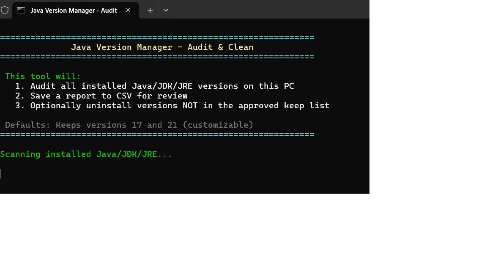
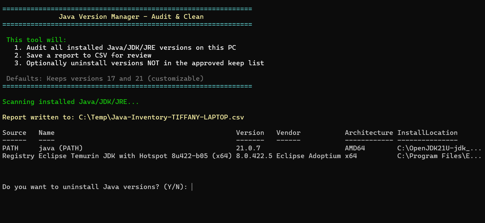
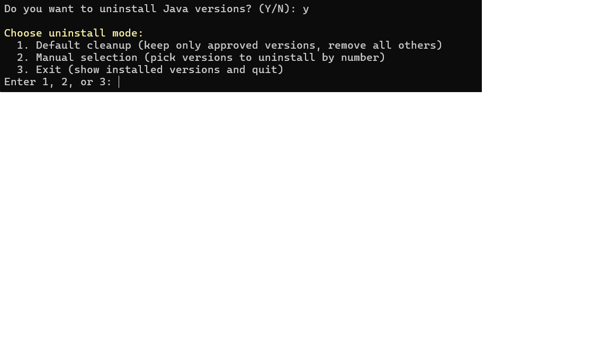
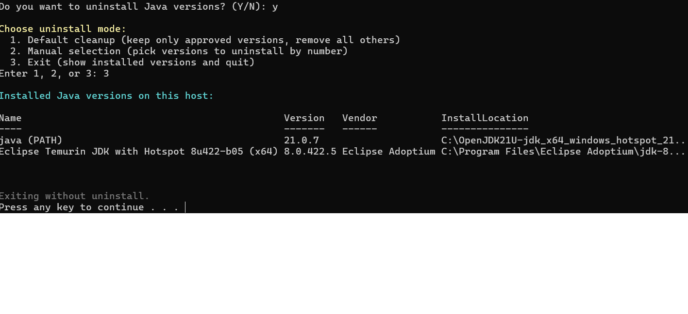

# Java Version Manager – Audit & Clean

This tool audits and manages installed Java/JDK/JRE versions on a Windows PC.  
It comes with a PowerShell script (`JavaTool.ps1`) and a batch file (`JavaTool.bat`) so users can run it easily without opening PowerShell manually.

---

## Features
- ✅ Audit all installed Java/JDK/JRE versions  
- ✅ Save a detailed report to CSV for review  
- ✅ Optionally uninstall versions **not in the approved keep list**  
- ✅ Defaults: Keeps versions 17 and 21 (customizable in script)  

---

## How to Run

1. Clone or download this repository.
2. Navigate to the folder:
3. Double-click **`JavaTool.bat`** to run the script.  
*(The `.bat` automatically launches `JavaTool.ps1` with the correct execution policy.)*

---

## Walkthrough

### **Step 1 – Launching the Tool**
When you run the `.bat` file, the tool starts scanning for installed Java versions.  

---

### **Step 2 – Scan Results**
The tool writes results to a CSV file and displays detected Java versions, vendors, and install locations.  

---

### **Step 3 – Choose Uninstall Mode**
If you choose to remove old versions, you’ll be prompted with uninstall options:  
1. Default cleanup (keep only approved versions, remove all others)  
2. Manual selection (choose which versions to uninstall)  
3. Exit (no uninstall, just show versions)  

---

### **Step 4 – Exit / Results**
If you select Exit, the tool shows the installed versions and quits without uninstalling.  

---
