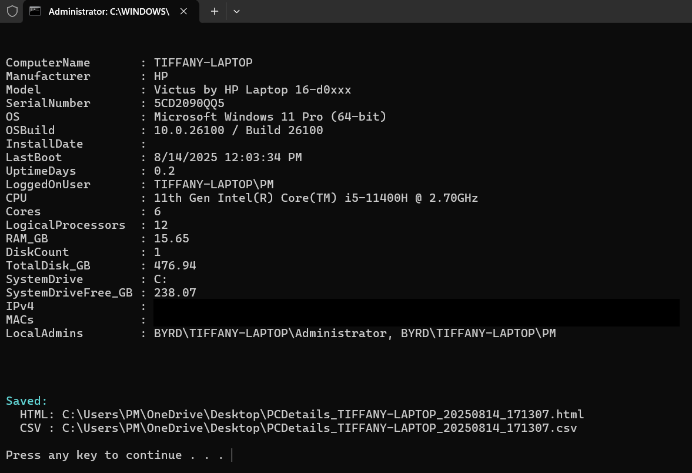
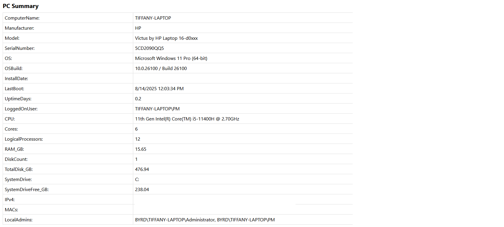
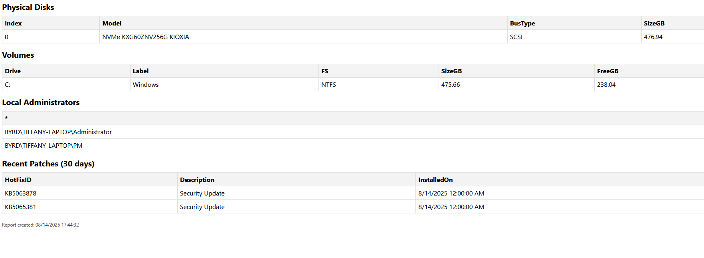

# PCDetails.ps1 – PC Inventory Script

## Overview
This PowerShell script collects detailed information about a Windows computer, including:
- Computer name
- Operating system and version
- Installed updates and their installation dates
- Hardware details (CPU, RAM, storage)
- Network configuration

The script outputs the collected data to a file, making it easy to share with support staff or keep for records.

---

## How This Script Helps
- **Troubleshooting:** Quickly gather system information for diagnosing issues.
- **Support Efficiency:** Support members can collect all relevant system details without manually checking multiple locations.
- **Record Keeping:** Store inventories for compliance, audits, or asset tracking.
- **Remote Assistance:** End-users can run the script themselves and send back the results.

---

## Why We Added a `.cmd` File
While PowerShell scripts (`.ps1`) are powerful, some users:
- Are unfamiliar with opening PowerShell and running commands.
- May have execution policies set that prevent scripts from running unless explicitly allowed.

To simplify this:
- We created a `.cmd` file (`Run-PCDetails.cmd`) that:
  1. Opens PowerShell automatically.
  2. Sets the correct execution policy for the session.
  3. Runs the `PCDetails.ps1` script without requiring the user to type commands.

This allows support members to **double-click** the `.cmd` file and immediately start collecting system details.

---

## How to Run

### Recommended Method – Double-click the `.cmd` File
1. Locate **`Run-PCDetails.cmd`** in the `PCDetails` folder.
2. Double-click the file.
3. The script will:
   - Open PowerShell.
   - Temporarily adjust execution settings.
   - Run `PCDetails.ps1` automatically.
4. Once finished, the output file will be generated in the same folder.
5. Send the output file to your support team.

**Note:**  
You do not need to open PowerShell or type any commands — the `.cmd` file does everything for you.

## Example Output

### Step 1 – Running the `.cmd` File
This is what you see in the Command Prompt when running `Run-PCDetails.cmd`:

---

### Step 2 – Viewing the HTML Report
After running the script, an HTML report is generated.  
Below are screenshots of the first and second pages of that report.

**First Page:**

**Second Page:**

